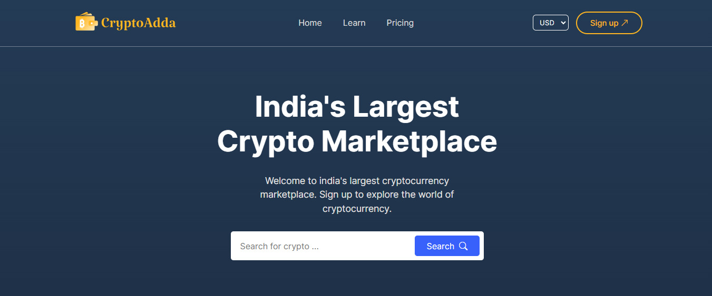

# CryptoAdda - Crypto Marketplace

## Description
CryptoAdda is a dynamic web application built with React and Coingecko API that provides information about various cryptocurrencies.CryptoAdda offers data on cryptocurrency prices, market capitalization, price charts etc.

## Features

* Cryptocurrency prices chart data
* Market capitalization data
* Select your own currency (eg. INR, USD, EUR)
* Search bar to quickly find specific cryptocurrencies
* Detailed view of each cryptocurrency
## Tech Stack

* React
* Coingecko API
* React google charts
* React router DOM
* Bootstrap icons

## Screenshots

